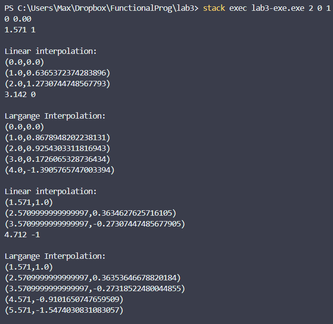
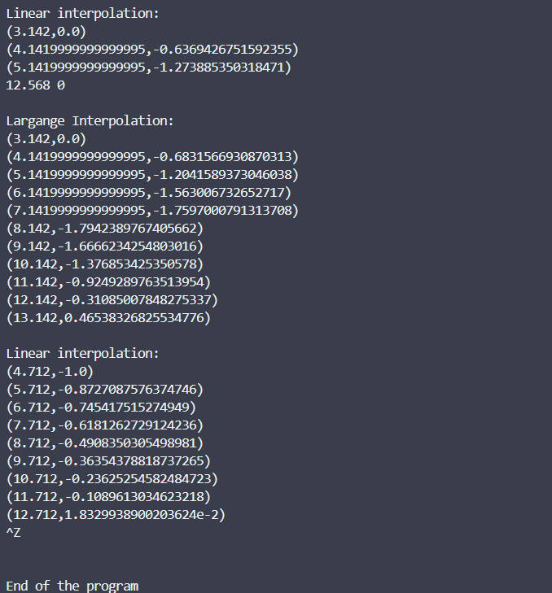

# Лабараторная работа №3

Шикунов Максим Евгеньевич P3333  

## Требования к разработанному ПО

1. Методы:
    - Линейная интерполяция
    - Лагранжа
2. Настройки алгоритма должны подаваться через аргументы командной строки.
3. Входные данные подаются на стандартный ввод.
4. Выходные данные подаются на стандартный вывод.
5. Программа должна работать в потоковм режиме (по мере получения данных должна выводить результат).

## Реализация программы

Два метода реализованы в файлу [Interpolation.hs](src/Interpolation.hs)  

### Линейный метод

```Haskell
linearInterpolation :: [Point] -> Double -> Double -> [Message]
linearInterpolation p step nowX = case p of
  [] -> []
  [(_, _)] -> []
  ((x1, y1) : (x2, y2) : _) -> case compare nowX x1 of
    LT -> linearInterpolation p step (nowX + step)
    EQ -> ((nowX, y1), "\nLinear interpolation:\n") : linearInterpolation p step (nowX + step)
    GT -> case compare nowX x2 of
      LT -> ((nowX, linFunc nowX), "") : linearInterpolation p step (nowX + step)
      EQ -> ((nowX, y2), "end") : linearInterpolation (tail p) step ((fst . head . tail) p)
      GT -> ((nowX, linFunc nowX), "end") : linearInterpolation (tail p) step ((fst . head . tail) p)
    where
      linFunc x = k * x + b
      k = (y2 - y1) / (x2 - x1)
      b = y1 - k * x1
```

### Метод Лагранжа

```Haskell
lagranInterpolation :: [Point] -> Double -> Double -> [Message]
lagranInterpolation p step nowX = case p of
  [] -> []
  [(_, _)] -> []
  [(_, _), (_, _)] -> []
  ((x1, y1) : (x2, y2) : (x3, y3) : _) -> case compare nowX x1 of
    LT -> lagranInterpolation p step (nowX + step)
    EQ -> ((nowX, y1), "\nLargange Interpolation:\n") : lagranInterpolation p step (nowX + step)
    GT -> case compare nowX x3 of
      LT -> ((nowX, polynom nowX), "") : lagranInterpolation p step (nowX + step)
      EQ -> ((nowX, y3), "end") : lagranInterpolation (tail p) step ((fst . head . tail) p)
      GT -> ((nowX, polynom nowX), "end") : lagranInterpolation (tail p) step ((fst . head . tail) p)
    where
      polynom x = y1 * l0 x + y2 * l1 x + y3 * l2 x
      l0 x = ((x - x2) * (x - x3)) / ((x1 - x2) * (x1 - x3))
      l1 x = ((x - x1) * (x - x3)) / ((x2 - x1) * (x2 - x3))
      l2 x = ((x - x1) * (x - x2)) / ((x3 - x1) * (x3 - x2))
```

### Печать данных

```haskell
printCoords :: [Message] -> MVar () -> IO ()
printCoords [] _ = putStrLn ""
printCoords points@((_, msg) : xs) printLock
  | msg == "end" || msg == "" = printCoords xs printLock
  | otherwise = do
      withMVar printLock $ \_ -> do
        let printHelp :: [Message] -> IO ()
            printHelp [] = return ()
            printHelp ((point, msg1) : xs1)
              | msg1 == "end" = print point
              | otherwise = do
                  putStr msg1
                  print point
                  printHelp xs1
        printHelp points
      printCoords xs printLock
```

### main

```haskell
main :: IO ()
main = do
  args <- getArgs
  let [method, start, step] = map read args :: [Double]
  let methods = [[linearInterpolation], [lagranInterpolation], [linearInterpolation, lagranInterpolation]] !! round method
  pointsList <- fmap (map words . lines) getContents
  let points = map (\[x, y] -> (read x, read y)) pointsList :: [(Double, Double)]
  printLock <- newMVar ()

  case methods of
    [singleMethod] ->
      printCoords (singleMethod points step start) printLock
    [method1, method2] -> do
      done1 <- newEmptyMVar
      done2 <- newEmptyMVar

      forkIO $ do
        printCoords (method1 points step start) printLock
        putMVar done1 ()

      forkIO $ do
        printCoords (method2 points step start) printLock
        putMVar done2 ()

      takeMVar done1
      takeMVar done2
      putStrLn "End of the program"
```

## Работа программы



